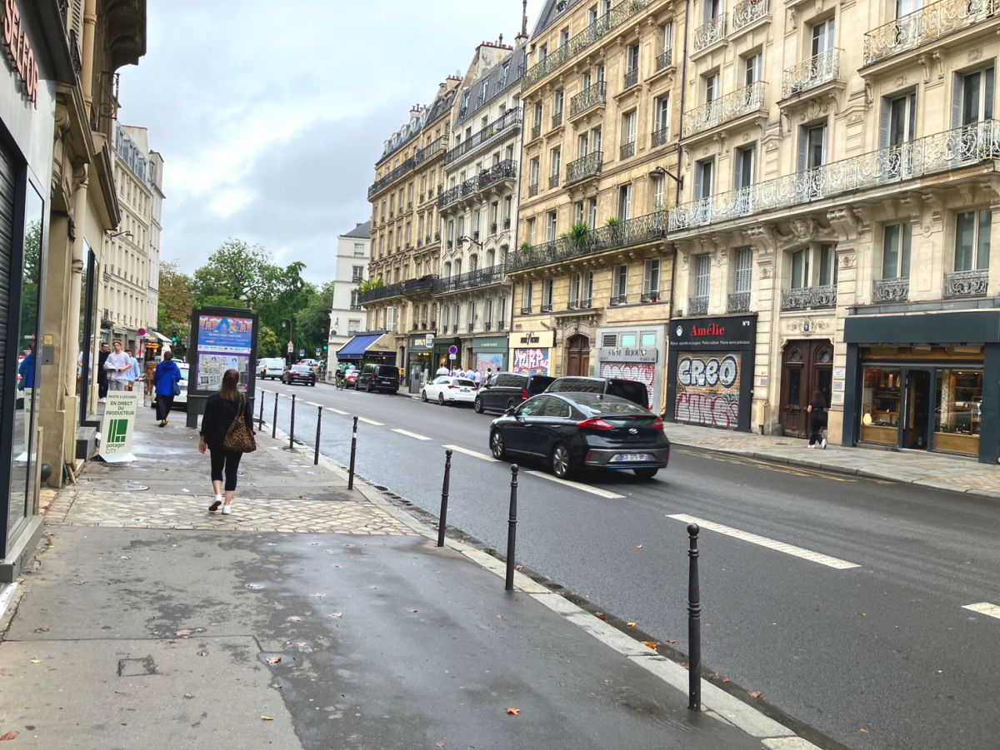
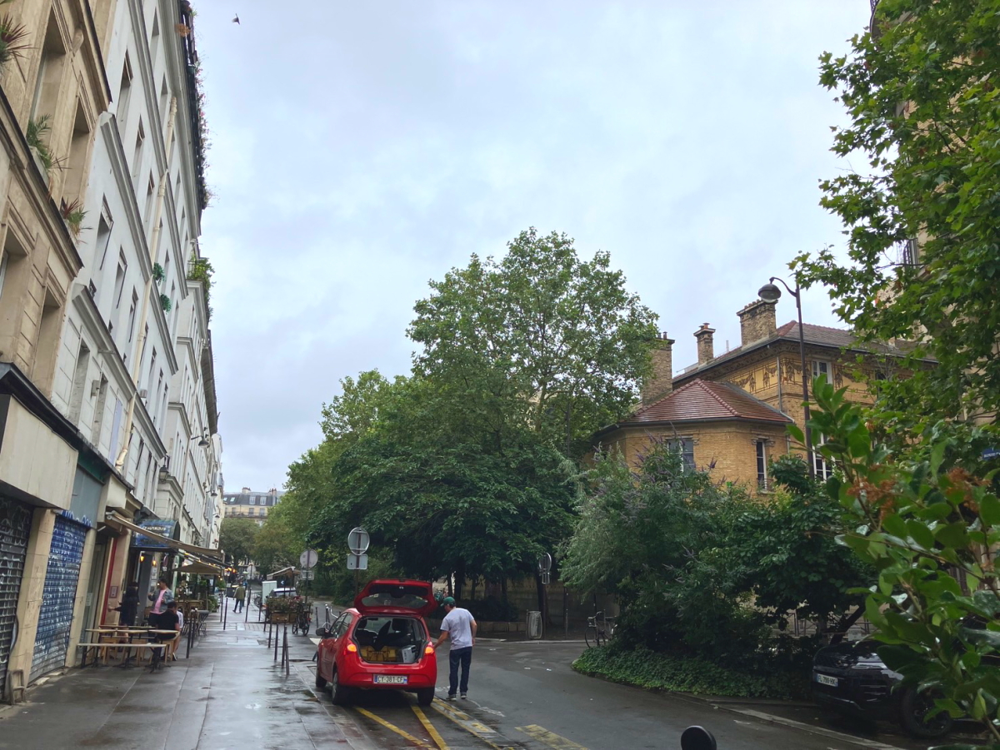
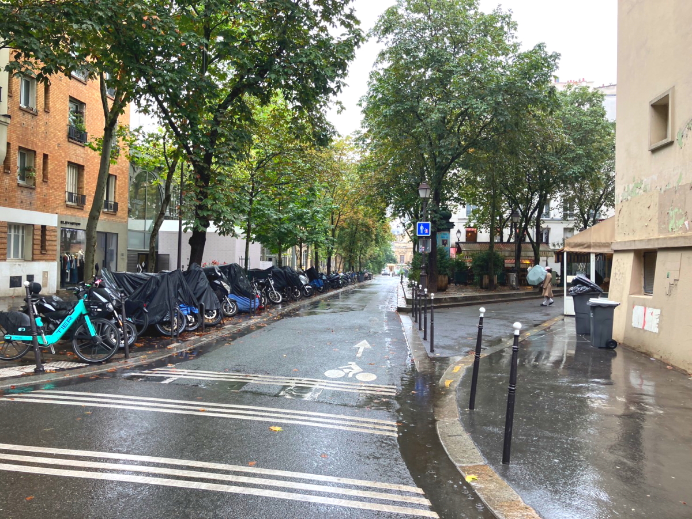
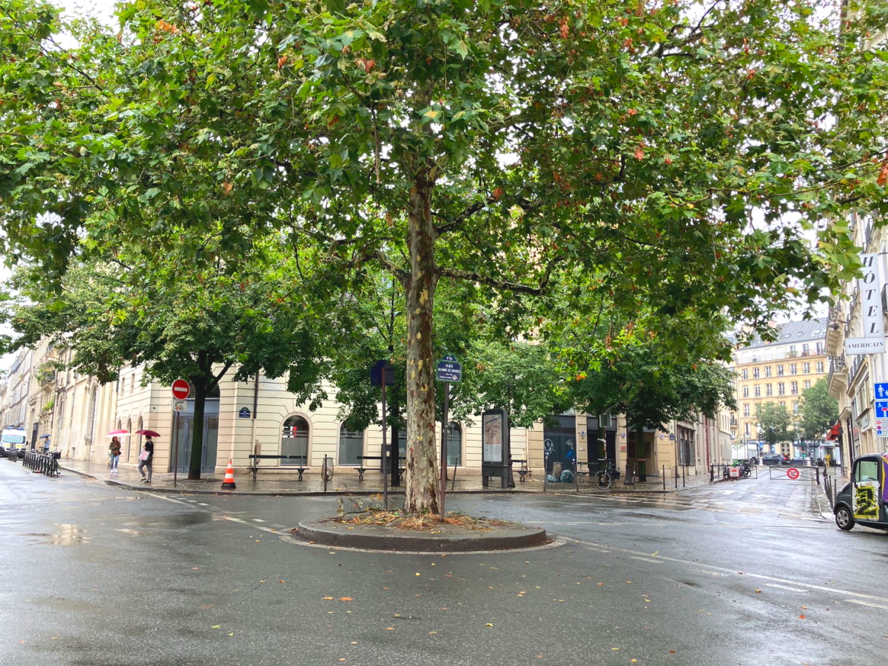
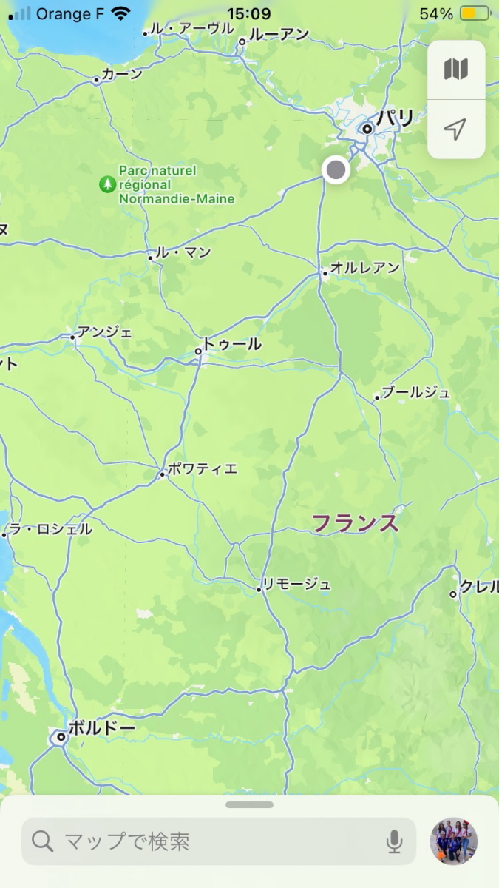

# 2024_paris7

<html lang="ja">
 <head>
  <meta charset="utf-8" />
 

<link href="https://cdnjs.cloudflare.com/ajax/libs/lightbox2/2.7.1/css/lightbox.css" rel="stylesheet">
   
</head>
<!--
<body onload="alert('65歳まで、よく頑張りました！　まだまだ元気に〜〜(^o^)/')" onunload="alert('再会の時まで、元気でお過ごしくださいませ〜(^o^)/')">
-->

  モバイル端末をお使いの場合は、画面を横向きにするとより見やすくご覧頂けます。

<!--
-->

<a href="https://torokoid.github.io/2024_paris/">2024年7月19日〜21日</a>><a href="https://torokoid.github.io/2024_paris2/">22日〜23日</a>><a href="https://torokoid.github.io/2024_paris3/">23日〜24日</a>><a href="https://torokoid.github.io/2024_paris4/">24日〜</a>><a href="https://torokoid.github.io/2024_paris5/">25日〜</a>><a href="https://torokoid.github.io/2024_paris6/">26日〜</a>>28日〜
<!--
-->

 &nbsp;Bruce 27日〜

<!--
<h2><a href="https://torokoid.github.io/list">クラス会名簿リンク</a></h2>
-->
  

 アクセス用QRコード

  

<marquee direction="right" scrollamount="20" width="30%">(^_^)/~hada</marquee>

<h2><marquee behavior="left">!!! 2024年7月27日、次女帰国。背景は完全にフランスに溶け込んだ娘さん（次女） !!!</marquee></h2>
<!--

-->
<!--
<h3> ～～～2024年7月25日着の画像です！～～～  </h3>
-->          

<h3> 次女が午後4時のフライトで帰国。朝一単独行動で買い物。 
11:30アパートを出て買い物 
私の電車は13:44 
ギリギリまで荷物番。13時私はモンパルナス駅へ。 
次女はトランク引きずりながらお買い物  

シャルル・ド・ゴール空港に到着の連絡あり。 
ボルドー行き電車は45分遅れで出発。到着17:00 
ホテルを探し開始。単独行動なのでホステル。  </h3>

<h3> ～～～Merciという有名店の最寄り駅から2回目のモンパルナス駅～～～  </h3>

<h3> ～～～パリからちょっと進んだだけで停車 
動きました。二回目のボルドー～～～  </h3>

<iframe width="560" height="315" src="https://www.youtube.com/embed/rfDYD2pdtbM?si=WU0pjqK343s5Dfxx" title="YouTube video player" frameborder="0" allow="accelerometer; autoplay; clipboard-write; encrypted-media; gyroscope; picture-in-picture; web-share" referrerpolicy="strict-origin-when-cross-origin" allowfullscreen></iframe>

<iframe width="560" height="315" src="https://www.youtube.com/embed/AMMiUkL5AZc?si=FX4ZkN79hwzXk6cl" title="YouTube video player" frameborder="0" allow="accelerometer; autoplay; clipboard-write; encrypted-media; gyroscope; picture-in-picture; web-share" referrerpolicy="strict-origin-when-cross-origin" allowfullscreen></iframe>

<iframe width="560" height="315" src="https://www.youtube.com/embed/Tp9fx551Ekc?si=fa6zikLnGwambW4Q" title="YouTube video player" frameborder="0" allow="accelerometer; autoplay; clipboard-write; encrypted-media; gyroscope; picture-in-picture; web-share" referrerpolicy="strict-origin-when-cross-origin" allowfullscreen></iframe>

<iframe width="560" height="315" src="https://www.youtube.com/embed/KTnwPPJx2e8?si=pvaZ-A4yzfTIlyq2" title="YouTube video player" frameborder="0" allow="accelerometer; autoplay; clipboard-write; encrypted-media; gyroscope; picture-in-picture; web-share" referrerpolicy="strict-origin-when-cross-origin" allowfullscreen></iframe>

<iframe width="560" height="315" src="https://www.youtube.com/embed/-yw6USNMlLU?si=uiEGHLnZaKcvDBG3" title="YouTube video player" frameborder="0" allow="accelerometer; autoplay; clipboard-write; encrypted-media; gyroscope; picture-in-picture; web-share" referrerpolicy="strict-origin-when-cross-origin" allowfullscreen></iframe>

<iframe width="560" height="315" src="https://www.youtube.com/embed/O6JqGDOPyXg?si=FDyl4cmyCKQwy1YE" title="YouTube video player" frameborder="0" allow="accelerometer; autoplay; clipboard-write; encrypted-media; gyroscope; picture-in-picture; web-share" referrerpolicy="strict-origin-when-cross-origin" allowfullscreen></iframe>

<h3> ～～～昨日のテロで混乱しているのか？～～～  </h3>

<h3> ～～～ホステルを予約。歩いていくことにした～～～  </h3>

<h3> ～～～このWIFIパスワードではつながらない。フロントの人に聞いたら、別の画面を開き、小文字だけの10文字以上のパリワードを入力してインターネット接続完了～～～  </h3>

<h3> ～～～サポートメンバーだったヴェルディ山本。今日と今ひとつ 
この試合は、GKが勝利を導くと予想。小久保ブライアンを撮影～～～  </h3>

<h2><marquee behavior="left">!!! （ナントで足止めされたので）荷物を預けて駅近くのお城へ。その後、買い物。 !!!</marquee></h2>

<h3> ～～～サポートメンバーだったヴェルディ山本。今日と今ひとつ 
この試合は、GKが勝利を導くと予想。小久保ブライアンを撮影～～～  </h3>

<h3> ～～～パリ行きのバスは順調。SAに一回だけ停車。電車が止まっているので渋滞が予想されたが、定刻22:55パリ郊外のバス停に到着。～～～  </h3>

<h3> ～～～地下鉄でホテル最寄り駅へ～～～  </h3>

<h3> ～～～心配した大家さんが寝ないでチャットしてくれました～～～  </h3>

<h3> ～～～最後にBruceからの鉄道復旧状況報告～～～  </h3>

<!--

<h3> ナデシコの試合をスタジアム観戦で偶然隣りの席が富士ゼロックス時代の先輩。 WCスタジアム観戦100試合以上の有名人。 
私の次女は仕事でWEリーグのイベント担当。フリーキックを決めた、藤野あおば。 フリートークさせると全く話せないらしい 
MVP清家が全く目立ってないのを残念がっていた。 
日本の攻撃は数回だけ。スペインのCB二人へのバックパスは殆どなかった。 日本は長谷川ですらGKバックパス連発。 
フリーキック獲得したスペインのファールはDOGSO、レッド出してもおかしくなかった。 
試合はスペインのボール回しに日本がなんとか耐える時間が長く、それを観客が固唾をのんで見守る。 静まりかえっていた。ゴール裏の日本サポーターですら声が出ない。 
逆転されるまで、スペイン人がエスパーニャと時々連呼 
フェイスペイントした日本サポーター、日本代表ユニフォームをきた男性白人、 ゲームキャラにフェイスペイントした日本サポーターが、 
バックスタンドの最前列前の通路で、歩きながらハーポンと叫びながら手拍子しても効果なし。 
途中交代する選手も全く活躍できない。日本が縦にボールをてもスペインの方が足が速くて触ることもできない 
それでも、ATにスペイン陣内でに入りこんだ。審判が左サイドへのパスコースにいたのには女子審判の経験不足、フィジカル不足を感じた。 
ルーズボールは全てスペインが拾う。日本が縦にボールを出せる形になっても、全てカット 
1-2で終わり、パラグアイみたいに大怪我しなくて幸い 
ブラジル戦はパリなのでチケット買えてない。 
オリンピックのサッカー人気は低下。スタジアムはガラガラ 
試合の後、食事する両サポーターの姿も乏しい。 
明日は、パリに移動してオープニングセレモニーをセーヌ川沿いのスタート地点あたりで見ます。 
翌日、ボルドーに戻り、日本対リマ観戦。その後、ナントで日本男女に試合スタジアム観戦。  </h3>

-->

      

                             

                             
        

  

 

<!-- フッタ -->
 <footer>
 <h3>Copyright 2024/Jul/29 S.Hada</h3>
 </footer>
